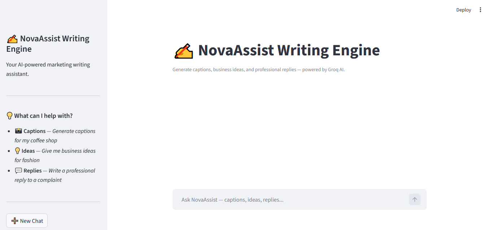

# SRS - Software Requirements Specification - NovaAssist

###### This document defines the software requirements for NovaAssist, an AI-powered marketing writing engine designed to help businesses generate social media captions and business ideas using conversational AI.

###### NovaAssist is a web-based chatbot application built using LangGraph, Groq AI (API Key) and Streamlit. It allows users to interact with an AI assistant through a chat interface to generate marketing content instantly.

# Screen Recording Voiceover
###### https://github.com/uzma-yakub-7/yakubs-codeyard/blob/main/nova-ai%20chatbot/lv_0_20260419010605%20(1).mp4

# Future Advancements: 

# References 
##### https://youtube.com/playlist?list=PLKnIA16_RmvYsvB8qkUQuJmJNuiCUJFPL&si=V2VH_7Uiihl_vNKQ (YouTube Playlist Agenti Ai using Langraph by CampusX)

###### https://github.com/campusx-official/chatbot-in-langgraph 
